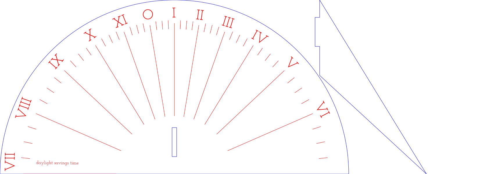

[](https://travis-ci.org/dps/sundial)
# sundial.py
A sundial laser-cutter template generator

```
usage: sundial.py [-h] [-o OUTFILE] --lat LATITUDE --lng LONGITUDE -d
                  DIAMETER_CM -t THICKNESS_IN [--dst]
                  [--adapt_for_meridian ADAPT_MERIDIAN]

optional arguments:
  -h, --help            show this help message and exit
  -o OUTFILE, --out OUTFILE
                        write SVG to FILE
  --lat LATITUDE        latitude in degrees
  --lng LONGITUDE       longitude in degrees
  -d DIAMETER_CM, --diameter DIAMETER_CM
                        sundial diameter in cm
  -t THICKNESS_IN, --material_thickness_in THICKNESS_IN
                        sundial material thickness in inches
  --dst                 mark dial in daylights savings time
  --adapt_for_meridian ADAPT_MERIDIAN
                        compensate for difference between longitude and
                        timezone meridian specified (e.g. pass -8 for Pacfic
                        Timezone, 0 for GMT)
```
                        
# Example - San Francisco
`python sundial.py --lat=37.7749 --lng=-122.4194 -d=24 -t=0.125 --dst -o golden/sf.svg`

produces:

